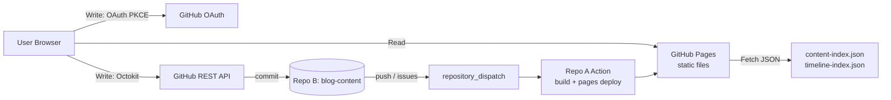

# ARCHITECTURE

## 전체 흐름 (Mermaid)

## 원칙

- Read: 정적 JSON 인덱스 기반 (런타임 GitHub API 호출 금지)
- Write: PKCE 로그인 후 Octokit으로만 수행
- 토큰 저장: 메모리만 사용(localStorage 금지)

## 2-Repo 구조

- Repo A(`blog-web`): 웹앱/빌드/배포
- Repo B(`blog-content`): 운영 콘텐츠(MDX/JSON) + 댓글 Issues

